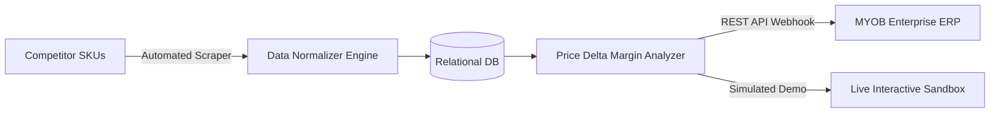
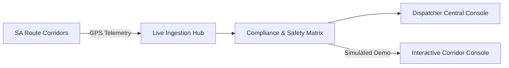
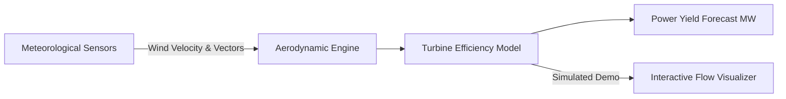

<div align="center">

# Hi there, I'm Yogeshkumar Patel 👋
### AI Developer & Design Engineer • Adelaide, Australia 🇦🇺

<p align="center">
  <em>"Obsessed with crafting bespoke, high-taste digital experiences, autonomous AI agents, and resilient enterprise systems."</em>
</p>

[](https://github.com/shahrukh-hack)
[](https://github.com/shahrukh-hack)
[](https://github.com/shahrukh-hack)

<br />

</div>

---

## ⚡ About Me & Core Focus

I am an AI developer and design engineer based in **Adelaide, South Australia**, specializing in **Autonomous AI Multi-Agent Workflows**, **High-Taste Design Engineering (UI/UX)**, and **Enterprise Systems Architecture**.

- 🪄 **High-Taste Web Design:** Eradicating robotic "AI slop" by engineering physics-based animations (Framer Motion / Emil Kowalski spring curves), bespoke typography pairings, and tactile interfaces.
- 🤖 **Autonomous AI Agents & RAG:** Building intelligent LLM pipelines, autonomous multi-agent workflows, and custom MCP tools using Antigravity, OpenAI, Claude, and Gemini.
- 🏢 **Enterprise Automation & Data Pipelines:** Architecting business automation engines, price scrapers, and ERP data synchronization systems.

---

## 🏛️ Enterprise Systems & Private Project Case Studies

Below are architectural breakdowns and **live interactive demo sandboxes** of proprietary and commercial systems engineered by Yogeshkumar Patel:

---

### 💼 Case Study 1: Enterprise ERP & Competitor Price Sync (`myob_price_sync` & `competitor_price_tracker`)
> **Domain:** E-Commerce, Wholesale & Retail Pricing Intelligence  
> **[▶ Launch Live Interactive Simulator](https://shahrukh-hack.github.io/vibe-superkit/#interactive-demos)**

* **The Challenge:** Retailers lost revenue from lagging competitor price adjustments and manual inventory entry into MYOB ERP.
* **The Solution:** Built a distributed headless scraping engine with relational persistence that continuously monitors market price deltas and automatically synchronizes price updates via the MYOB Cloud REST API.
* **Tech Stack:** `Python` • `FastAPI` • `PostgreSQL` • `MYOB API Webhooks` • `Playwright`



---

### 🚗 Case Study 2: South Australia Smart Fleet & Driver Hub (`sa-drive-smart-hub`)
> **Domain:** Regional Mobility, Logistics & Transport Compliance (Adelaide, SA)  
> **[▶ Launch Live Interactive Simulator](https://shahrukh-hack.github.io/vibe-superkit/#interactive-demos)**

* **The Challenge:** Dispatchers required real-time corridor monitoring, driver duty compliance, and incident telemetry across South Australian transport routes.
* **The Solution:** Engineered a responsive fleet management platform featuring dynamic route corridor filtering, status metrics, and geofencing telemetry.
* **Tech Stack:** `React 18` • `TypeScript` • `Tailwind CSS` • `Mapbox/Leaflet` • `Lucide`



---

### 🌬️ Case Study 3: Aerodynamic Airflow & Turbine Analytics (`wind-flow-insights`)
> **Domain:** Renewable Energy & Environmental Modeling  
> **[▶ Launch Live Interactive Simulator](https://shahrukh-hack.github.io/vibe-superkit/#interactive-demos)**

* **The Challenge:** Stakeholders needed an intuitive interface to model wind turbine power yields based on real-time meteorological vector fields.
* **The Solution:** Developed a mathematical vector animation dashboard that simulates laminar wind velocity, turbine efficiency curves, and estimated power generation (MW).
* **Tech Stack:** `React` • `TypeScript` • `D3.js` • `Vector Mathematics` • `Tailwind CSS`



---

### ⚙️ Case Study 4: Precision CNC Manufacturing & Client Portal (`cncnew-website`)
> **Domain:** Industrial Manufacturing & Engineering CAD Requests  
> **[▶ Launch Live Interactive Simulator](https://shahrukh-hack.github.io/vibe-superkit/#interactive-demos)**

* **The Challenge:** Manufacturing clients needed a streamlined portal to request CNC machining quotes, review technical specifications, and track order fulfillment.
* **The Solution:** Engineered a responsive engineering service portal featuring interactive service catalogs, instant quotation workflows, and material specifications.
* **Tech Stack:** `HTML5` • `Tailwind CSS` • `JavaScript` • `Vite`

---

## 🌟 Public Flagship Applications & Live Demos

| Project | GitHub Repository | 🌐 Standalone Live Demo | Description |
| :--- | :--- | :--- | :--- |
| **🪄 Vibe Superkit** | [`shahrukh-hack/vibe-superkit`](https://github.com/shahrukh-hack/vibe-superkit) | **[Live Demo](https://shahrukh-hack.github.io/vibe-superkit/)** | Anti-AI Slop & High-Taste Design Engine for Vibe Coders & Antigravity agents. |
| **📈 Lakshmi AI** | [`shahrukh-hack/lakhsmiAI`](https://github.com/shahrukh-hack/lakhsmiAI) | **[Live Demo](https://shahrukh-hack.github.io/lakhsmiAI/)** | Stock market forecasting & financial intelligence dashboard with ApexCharts. |
| **🌬️ LCA Wind Turbine** | [`shahrukh-hack/LCA-bolt`](https://github.com/shahrukh-hack/LCA-bolt) | **[Live Demo](https://shahrukh-hack.github.io/LCA-bolt/)** | Wind turbine Life Cycle Assessment with D3 Sankey carbon flow diagrams. |
| **🌐 Siddheshwar Sai Infotech** | [`shahrukh-hack/ssi`](https://github.com/shahrukh-hack/ssi) | **[Live Demo](https://shahrukh-hack.github.io/ssi/)** | Enterprise IT consulting, cloud infrastructure, and AI solutions web portal. |
| **📄 Document Similarity** | [`shahrukh-hack/similarity-new`](https://github.com/shahrukh-hack/similarity-new) | **[Live Demo](https://shahrukh-hack.github.io/similarity-new/)** | Semantic document comparison, text overlap analysis, and plagiarism verification. |
| **🛡️ AI Content Detector** | [`shahrukh-hack/AI-detection`](https://github.com/shahrukh-hack/AI-detection) | **[Live Demo](https://shahrukh-hack.github.io/AI-detection/)** | Real-time linguistic perplexity and synthetic vs human text detection platform. |
| **🤖 Awesome LLM Apps** | [`shahrukh-hack/awesome-llm-apps`](https://github.com/shahrukh-hack/awesome-llm-apps) | [`GitHub`](https://github.com/shahrukh-hack/awesome-llm-apps) | Production LLM applications, autonomous agent workflows, and RAG architectures. |

---

## 🛠️ Technical Stack & Arsenal

| Domain | Core Technologies |
| :--- | :--- |
| **Frontend & Design** | `React 19` `Next.js` `TypeScript` `Tailwind CSS` `Framer Motion` `Radix UI` `Lenis` `D3.js` `VisX` |
| **AI & LLM Workflows** | `Autonomous Agents` `RAG Pipelines` `Antigravity` `OpenAI` `Claude` `Gemini` `MCP Protocol` |
| **Backend & Automation** | `Python` `FastAPI` `Node.js` `REST APIs` `PostgreSQL` `Data Scraping & Sync` `MYOB API` |
| **Tooling & Cloud** | `Git` `GitHub Actions` `Docker` `Vite` `VS Code` `Cursor` `Linux` `Terminal` |

---

## 📊 Developer Snapshot

```yaml
Name: Yogeshkumar Patel
Location: Adelaide, South Australia (ACST / UTC+9:30)
Role: AI Developer & Design Engineer
Primary Stack: TypeScript, React, Next.js, Python, Tailwind, Framer Motion
Specialties: Autonomous Agents, RAG Pipelines, Bespoke High-Taste Web Systems, Enterprise Sync
Current Focus: Building Next-Gen Vibe Coding Tools & AI-Native Applications
Open For: High-Impact AI Projects, Consultations & Full-Stack Collaboration
```

---

<div align="center">
  <p><b>Interested in collaborating or building high-taste AI products?</b></p>
  <a href="https://github.com/shahrukh-hack">
    
  </a>
  <br /><br />
  <sub>Designed with intention by Yogeshkumar Patel • Adelaide, South Australia 🇦🇺</sub>
</div>
