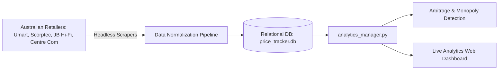
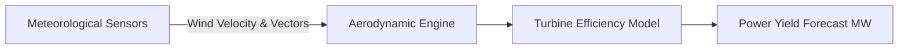
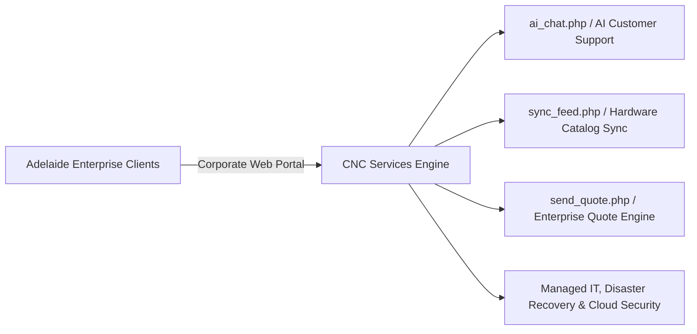

<div align="center">

# Hi there, I'm Yogeshkumar Patel 👋
### Web & Marketing Coordinator @ HYKA Technology • AI Developer & Design Engineer
**Adelaide, South Australia 🇦🇺**

<p align="center">
  <em>"Bridging high-impact digital marketing strategy, conversion-focused web engineering, autonomous AI agent architectures, and resilient enterprise automation systems."</em>
</p>

[](https://www.linkedin.com/in/yogeshkumar-ai/)
[](https://github.com/shahrukh-hack)
[](https://github.com/shahrukh-hack)
[](https://www.linkedin.com/in/yogeshkumar-ai/)
[](https://github.com/shahrukh-hack)

<br />

</div>

---

## ⚡ About Me & Professional Focus

I am a **Web & Marketing Coordinator at HYKA Technology** and an **AI Developer & Design Engineer** based in **Adelaide, South Australia**. I combine strategic marketing coordination with modern full-stack web engineering, physics-based UI/UX design, and autonomous AI automation.

- 💼 **Web & Marketing Coordination @ HYKA Technology:** Driving digital brand growth, coordinating conversion-driven web initiatives, campaign execution, CRO, and technical marketing systems.
- 🪄 **High-Taste Design Engineering:** Eradicating robotic "AI slop" by engineering physics-based animations (Framer Motion / Emil Kowalski spring curves), bespoke typography pairings, and tactile interfaces.
- 🤖 **Autonomous AI Agents & RAG:** Building intelligent LLM pipelines, autonomous multi-agent workflows, and custom MCP tools using Antigravity, OpenAI, Claude, and Gemini.
- 🏢 **Enterprise Automation & Data Pipelines:** Architecting business automation engines, price scrapers, and ERP data synchronization systems.

---

## 🏄‍♂️ The Vibe Coder's Power Suite (4 Flagship Open-Source Engines)

A complete open-source developer ecosystem engineered to empower modern **Vibe Coders** and autonomous AI agents with **impeccable visual taste, persistent memory, battle-tested guardrails, and autonomous team orchestration**:

```
                                    ┌────────────────────────────────────────┐
                                    │       THE VIBE CODER'S POWER SUITE     │
                                    └───────────────────┬────────────────────┘
                                                        │
         ┌──────────────────────────────┬───────────────┴──────────────┬──────────────────────────────┐
         ▼                              ▼                              ▼                              ▼
┌───────────────────┐          ┌───────────────────┐          ┌───────────────────┐          ┌───────────────────┐
│ 🪄 VIBE SUPERKIT  │          │  🧠 VIBE MEMORY   │          │  ⚡ VIBE SKILLS   │          │  🤖 VIBE AGENCY   │
│   "The Visuals"   │          │    "The Brain"    │          │ "The Guardrails"  │          │ "The Orchestrator"│
├───────────────────┤          ├───────────────────┤          ├───────────────────┤          ├───────────────────┤
│ • Anti-AI Slop    │          │ • Long-Term Memory│          │ • 50 Standard     │          │ • Multi-Agent     │
│ • Spring Physics  │          │ • Cross-Agent     │          │   Agent Skills    │          │   Teams & Roles   │
│ • 26 Components   │          │   Handoffs        │          │ • 10 UI Framework │          │ • Inter-Agent     │
│ • Stripe UI Style │          │ • 97% Token Save  │          │   Playbooks       │          │   Inbox & Cron    │
└───────────────────┘          └───────────────────┘          └───────────────────┘          └───────────────────┘
```

1. **🪄 [`vibe-superkit`](https://github.com/shahrukh-hack/vibe-superkit)** — *The Visual Engine:* Banishes generic AI-slop (purple glows, un-tracked type, cliché bento boxes) with Emil Kowalski spring physics, 26 production components, and Stripe/Tailwind UI design standards. ([Live Interactive Demo](https://shahrukh-hack.github.io/vibe-superkit/))
2. **🧠 [`vibe-memory`](https://github.com/shahrukh-hack/vibe-memory)** — *The Brain & AST Intelligence:* Solves "AI amnesia" on conversation resets, enables zero-friction handoffs across Antigravity ↔ Cursor ↔ Claude Code, and cuts context tokens by **97%** via AST symbol indexing. ([Live Graph Visualizer](https://shahrukh-hack.github.io/vibe-memory/))
3. **⚡ [`vibe-skills`](https://github.com/shahrukh-hack/vibe-skills)** — *The Autonomous Guardrails:* Mega-library of **50 standard agent skills** (`agentskills.io`) and **10 UI framework playbooks** (Shadcn, Framer Motion, Emil Kowalski, Origin UI, cmdk, Aceternity, Lenis, Lucide, UI UX Pro Max, 21st.dev) with 1-command CLI (`npx vibe-skills add <skill>`).
4. **🤖 [`vibe-agency`](https://github.com/shahrukh-hack/vibe-agency)** — *The Autonomous Team Orchestrator:* Define agent roles in Markdown, schedule overnight data pipelines on a heartbeat cron, and delegate tasks between agents via inter-agent inbox queues. ([Live Web Console](https://shahrukh-hack.github.io/vibe-agency/))
5. **🌐 [`vibe-wp`](https://github.com/shahrukh-hack/vibe-wp)** — *The WordPress MCP Engine:* Direct PHP runtime execution, WooCommerce product & inventory controls, and Gutenberg React block scaffolding for Antigravity, Cursor, and Claude Code. ([Live Sandbox](https://shahrukh-hack.github.io/vibe-wp/))

---

## 🌟 Public Flagship Applications & Open-Source Tools

| Project | GitHub Repository | 🌐 Standalone Live Demo | Description |
| :--- | :--- | :--- | :--- |
| **🪄 Vibe Superkit** | [`shahrukh-hack/vibe-superkit`](https://github.com/shahrukh-hack/vibe-superkit) | **[Live Demo](https://shahrukh-hack.github.io/vibe-superkit/)** | Anti-AI Slop & High-Taste Design Engine for Vibe Coders (26 Components). |
| **🧠 Vibe Memory** | [`shahrukh-hack/vibe-memory`](https://github.com/shahrukh-hack/vibe-memory) | **[Live Demo](https://shahrukh-hack.github.io/vibe-memory/)** | Universal Long-Term Memory & Codebase AST Intelligence (97% Token Reduction). |
| **🌐 Vibe WP** | [`shahrukh-hack/vibe-wp`](https://github.com/shahrukh-hack/vibe-wp) | **[Live Demo](https://shahrukh-hack.github.io/vibe-wp/)** | Universal MCP Server & Runtime for WordPress, WooCommerce & ACF. |
| **🤖 Vibe Agency** | [`shahrukh-hack/vibe-agency`](https://github.com/shahrukh-hack/vibe-agency) | **[Live Demo](https://shahrukh-hack.github.io/vibe-agency/)** | Autonomous Multi-Agent Team Orchestrator & Live Web Console. |
| **⚡ Vibe Skills** | [`shahrukh-hack/vibe-skills`](https://github.com/shahrukh-hack/vibe-skills) | [`GitHub`](https://github.com/shahrukh-hack/vibe-skills) | Mega-Library of 50 Standard Agent Skills & 10 UI Framework Playbooks. |
| **📈 Lakshmi AI** | [`shahrukh-hack/lakhsmiAI`](https://github.com/shahrukh-hack/lakhsmiAI) | **[Live Demo](https://shahrukh-hack.github.io/lakhsmiAI/)** | Stock market forecasting & financial intelligence dashboard with ApexCharts. |
| **🌬️ LCA Wind Turbine** | [`shahrukh-hack/LCA-bolt`](https://github.com/shahrukh-hack/LCA-bolt) | **[Live Demo](https://shahrukh-hack.github.io/LCA-bolt/)** | Wind turbine Life Cycle Assessment with D3 Sankey carbon flow diagrams. |
| **🌐 Siddheshwar Sai Infotech** | [`shahrukh-hack/ssi`](https://github.com/shahrukh-hack/ssi) | **[Live Demo](https://shahrukh-hack.github.io/ssi/)** | Enterprise IT consulting, cloud infrastructure, and AI solutions web portal. |
| **📄 Document Similarity** | [`shahrukh-hack/similarity-new`](https://github.com/shahrukh-hack/similarity-new) | **[Live Demo](https://shahrukh-hack.github.io/similarity-new/)** | Semantic document comparison, text overlap analysis, and plagiarism verification. |
| **🛡️ AI Content Detector** | [`shahrukh-hack/AI-detection`](https://github.com/shahrukh-hack/AI-detection) | **[Live Demo](https://shahrukh-hack.github.io/AI-detection/)** | Real-time linguistic perplexity and synthetic vs human text detection platform. |
| **🤖 Awesome LLM Apps** | [`shahrukh-hack/awesome-llm-apps`](https://github.com/shahrukh-hack/awesome-llm-apps) | [`GitHub`](https://github.com/shahrukh-hack/awesome-llm-apps) | Production LLM applications, autonomous agent workflows, and RAG architectures. |

---

## 🏛️ Enterprise Systems & Commercial Architecture

Below are in-depth technical specifications and architectural workflows for private enterprise systems engineered by Yogeshkumar Patel:

---

### 📊 1. Excel-Driven Competitor Price Tracker (`competitor_price_tracker`)
> **Domain:** Automated E-Commerce Scraping & Spreadsheet Reporting

* **The Problem:** Merchandisers needed a lightweight way to monitor competitor price shifts from daily email feeds and Excel price lists without modifying their existing spreadsheet workflow.
* **The Solution:** Engineered an automated Python tracking engine with email alert parsers (`email_fetcher.py`), scheduled background workers (`scheduler.py`), and price difference recalculators (`price_updater.py`) exporting clean comparative Excel/CSV reports.
* **Tech Stack:** `Python 3` • `Pandas` • `OpenPyXL` • `BeautifulSoup4` • `Async Scheduler`


---

### 🗄️ 2. Database-Backed Retail Intelligence & Arbitrage Engine (`competitor_price_tracker_db`)
> **Domain:** Multi-Retailer Scraping, Relational Database & Real-Time Analytics

* **The Problem:** Enterprise retail businesses tracking thousands of electronics SKUs across multiple major Australian retailers (Scorptec, Umart, JB Hi-Fi, Centre Com, JW, The Good Guys) required a persistent relational database, category-level margin tracking, and price arbitrage analytics.
* **The Solution:** Architected a high-throughput scraping engine backed by a relational SQLite database (`price_tracker.db`), modular scraper workers, an automated analytics manager (`analytics_manager.py`), and an interactive web dashboard with price history and monopoly detection.
* **Tech Stack:** `Python` • `SQLite / SQLAlchemy` • `FastAPI / REST` • `Playwright / Chromium` • `Chart.js`



---

### ⚡ 3. Excel-to-MYOB ERP Cloud Price Sync Engine (`myob_price_sync`)
> **Domain:** Financial & Enterprise ERP Automation Pipeline

* **The Problem:** Finance and inventory teams spent hours manually re-typing approved Excel supplier price sheets into MYOB ERP, resulting in margin errors and fulfillment delays.
* **The Solution:** Engineered a dedicated Excel-to-ERP bridge (`price_reader.py`) that validates spreadsheet data, handles currency/tax normalization, and automatically commits bulk item price updates to MYOB AccountRight / Essentials via the official MYOB REST API (`myob_client.py`) with token refresh and rate limiting.
* **Tech Stack:** `Python` • `MYOB Cloud REST API` • `OAuth2 Integration` • `OpenPyXL` • `FastAPI Webhook Bridge`


---

### 🚗 4. South Australia Smart Fleet & Driver Hub (`sa-drive-smart-hub`)
> **Domain:** Regional Mobility, Logistics & Transport Compliance (Adelaide, SA)

* **The Problem:** Fleet dispatchers required real-time corridor monitoring, driver duty compliance, and incident telemetry across South Australian transport routes.
* **The Solution:** Engineered a responsive fleet management platform featuring dynamic route corridor filtering, status metrics, and geofencing telemetry.
* **Tech Stack:** `React 18` • `TypeScript` • `Tailwind CSS` • `Mapbox/Leaflet` • `Lucide`


---

### 🌬️ 5. Aerodynamic Airflow & Turbine Yield Analytics (`wind-flow-insights`)
> **Domain:** Renewable Energy & Environmental Modeling

* **The Problem:** Stakeholders needed an intuitive interface to model wind turbine power yields based on real-time meteorological vector fields.
* **The Solution:** Developed a mathematical vector animation dashboard that simulates laminar wind velocity, turbine efficiency curves, and estimated power generation (MW).
* **Tech Stack:** `React` • `TypeScript` • `D3.js` • `Vector Mathematics` • `Tailwind CSS`



---

### 🏢 6. CNC Corporate IT Services & E-Commerce Platform (`cncnew-website`)
> **Domain:** Enterprise Managed IT, Disaster Recovery, Cloud Security & IT Hardware Shop (Adelaide, SA)

* **The Problem:** An established South Australian managed IT service provider needed a modern, high-performance web portal integrating enterprise service catalogs (Disaster Recovery, Network Management, Server Solutions), live hardware inventory feeds, automated quote generators, and an intelligent AI customer support chat engine.
* **The Solution:** Architected a comprehensive full-stack corporate portal featuring dynamic product catalogs (`products.json`), automated inventory feed synchronizers (`sync_feed.php`), instant quote generation workflows (`send_quote.php`), customer survey engines, and an integrated AI support assistant (`ai_chat.php`).
* **Tech Stack:** `PHP Backend` • `JavaScript (ES6+)` • `Tailwind CSS` • `REST Endpoints` • `AI Chatbot Integration` • `Automated Survey Engines`



---

## 🛠️ Technical Stack & Arsenal

| Domain | Core Technologies |
| :--- | :--- |
| **Marketing & Growth** | `Web Strategy` `Conversion Optimization (CRO)` `Campaign Coordination` `SEO & Performance` `Digital Analytics` |
| **Frontend & Design** | `React 19` `Next.js` `TypeScript` `Tailwind CSS` `Framer Motion` `Radix UI` `Lenis` `D3.js` `VisX` |
| **AI & LLM Workflows** | `Autonomous Agents` `Multi-Agent Teams` `RAG Pipelines` `Antigravity` `OpenAI` `Claude` `Gemini` `MCP Protocol` |
| **Backend & Automation** | `Python` `FastAPI` `PHP` `Node.js` `REST APIs` `PostgreSQL` `SQLite` `MYOB API` |
| **Tooling & Cloud** | `Git` `GitHub Actions` `Docker` `Vite` `VS Code` `Cursor` `Linux` `Terminal` |

---

## 📊 Developer Snapshot

```yaml
Name: Yogeshkumar Patel
Current Role: Web & Marketing Coordinator @ HYKA Technology
Location: Adelaide, South Australia (ACST / UTC+9:30)
Core Focus: Web Strategy, Marketing Coordination, AI Systems & Design Engineering
Primary Stack: TypeScript, React, Next.js, Python, Tailwind CSS, Framer Motion, PHP
Specialties: Digital Marketing Systems, Autonomous Agents, High-Taste UI/UX, ERP Integration
LinkedIn: https://www.linkedin.com/in/yogeshkumar-ai/
Open For: High-Impact AI Projects, Technical Consultations & Full-Stack Collaboration
```

---

<div align="center">
  <p><b>Interested in collaborating or building high-impact digital products?</b></p>
  <a href="https://www.linkedin.com/in/yogeshkumar-ai/">
    
  </a>
  &nbsp;&nbsp;
  <a href="https://github.com/shahrukh-hack">
    
  </a>
  <br /><br />
  <sub>Designed with intention by Yogeshkumar Patel • Adelaide, South Australia 🇦🇺</sub>
</div>
